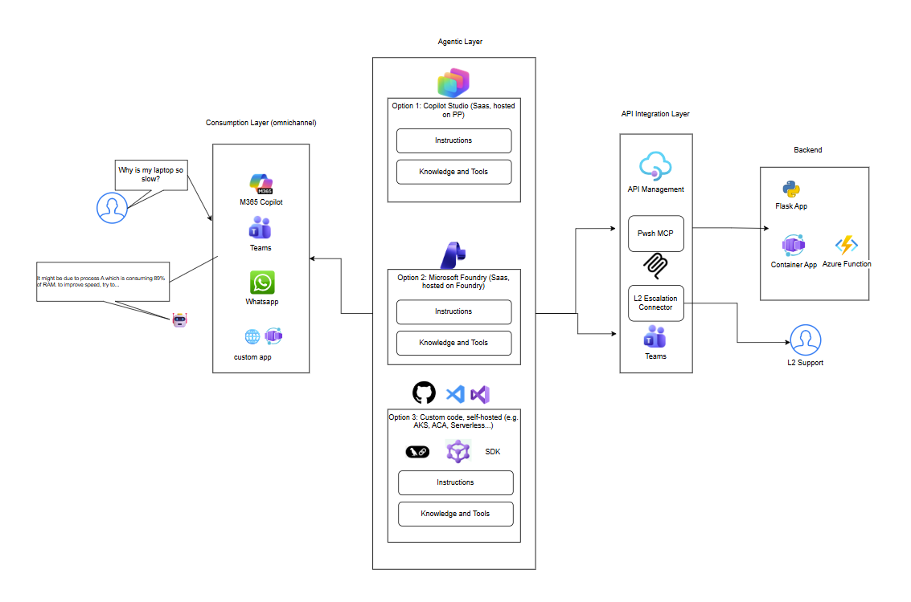
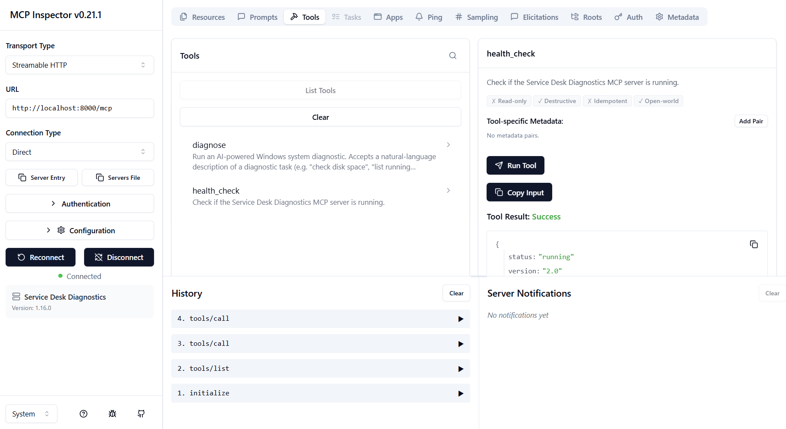
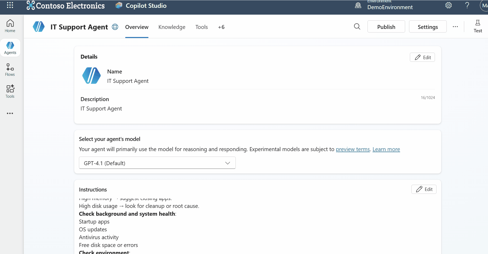
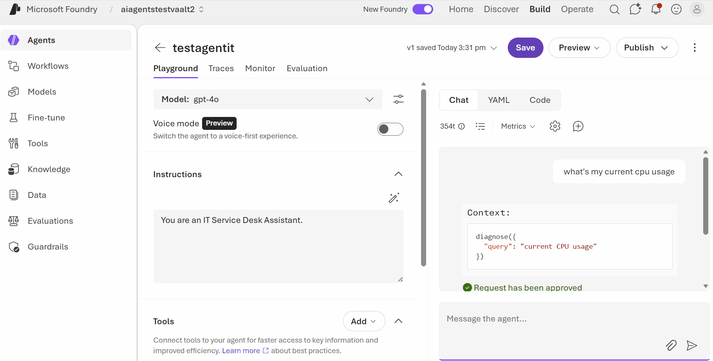
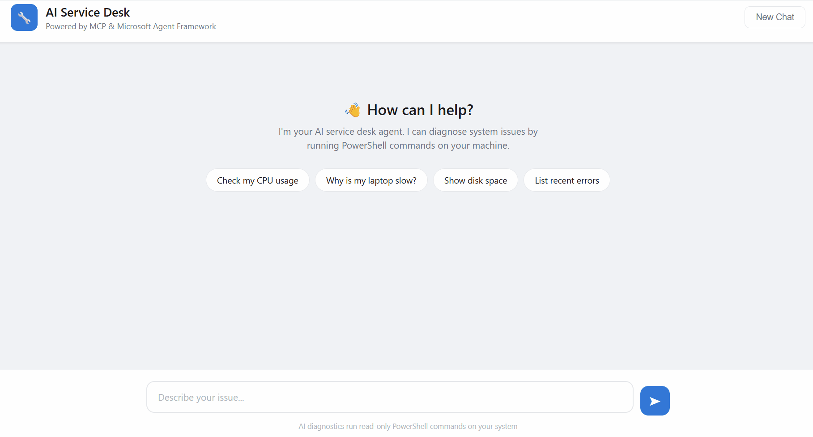

# 🛠️ Service Desk Diagnostics — MCP Server

An AI-powered IT service desk diagnostic tool exposed as a **Model Context Protocol (MCP)** server. It accepts natural-language queries (e.g. *"Why is my laptop slow?"*), uses an LLM to generate safe, read-only PowerShell commands, executes them, and returns structured diagnostic results.

**The beauty of MCP is that once you build a server, any MCP-compatible client can use it** — whether that's Microsoft Copilot Studio, Azure AI Foundry Agents, a custom agent built with Microsoft Agent Framework, or any other MCP client.

---

## Why MCP?

The [Model Context Protocol](https://github.com/modelcontextprotocol/python-sdk) is an **open standard** that separates *tool/data providers* (servers) from *AI applications* (clients). Think of it like a USB-C port for AI tools:

- **Build once, use everywhere** — your MCP server works with any MCP client
- **Standardized tool discovery** — clients automatically discover available tools, their parameters, and descriptions
- **Transport flexibility** — supports stdio, SSE, and Streamable HTTP
- **No vendor lock-in** — it's an open protocol, not tied to any single framework

This means the same diagnostic server below can be consumed from Copilot Studio, Foundry, Claude, VS Code, or your own custom agent — without changing a single line of server code.

---

## Architecture



---

## Quick Start

### 1. Install dependencies

```bash
pip install "mcp[cli]" openai azure-identity
```

### 2. Authenticate with Azure

```bash
az login
```

### 3. Run the MCP server

```bash
python mcp_server.py
```

The server starts at `http://127.0.0.1:8000` using Streamable HTTP transport.

### 4. Test with MCP Inspector

```bash
npx -y @modelcontextprotocol/inspector
```



Connect to `http://127.0.0.1:8000` in the Inspector UI, then call the `diagnose` tool.

---

## How `mcp_server.py` Works

| Component | Purpose |
|---|---|
| **`FastMCP`** | High-level MCP server from the [Python SDK](https://github.com/modelcontextprotocol/python-sdk) — handles protocol, tool registration, and transport |
| **`diagnose` tool** | Accepts a natural-language query, calls Azure OpenAI to generate a PowerShell command, executes it locally, returns the result |
| **`health_check` tool** | Simple liveness probe |
| **Lazy auth** | Azure AD credentials are acquired once and cached — the server starts instantly |
| **CORS middleware** | Enables browser-based MCP clients (Inspector, web apps) to connect |
| **Stateless HTTP** | Recommended for production; each request is independent — no session state to manage |

### Key code walkthrough

```python
from mcp.server.fastmcp import FastMCP

# Create the MCP server
mcp = FastMCP(
    "Service Desk Diagnostics",
    stateless_http=True,       # No session persistence needed
    json_response=True,        # Return JSON (vs SSE streaming)
    streamable_http_path="/",  # Serve at root path
)

@mcp.tool()
def diagnose(query: str) -> dict:
    """Run an AI-powered Windows system diagnostic."""
    script = generate_powershell_command(query)   # LLM generates PowerShell
    result = run_powershell(script)               # Execute locally
    return {"result": result}
```

That's it — the `@mcp.tool()` decorator handles schema generation, parameter validation, and protocol compliance automatically.

---

## Exposing the MCP Server

Your MCP server runs locally on `http://127.0.0.1:8000`. Cloud-based clients (Foundry, Copilot Studio) need a publicly reachable URL. There are several ways to achieve this.

### Option A: Local MCP server + ngrok (used in this project)

This is the simplest approach and the one used in this project. The MCP server runs **on your local machine** alongside the diagnostic tools — so it can execute PowerShell commands directly, with no extra moving parts. [ngrok](https://ngrok.com/) then creates a secure tunnel to give it a public HTTPS URL.

```bash
# 1. Start the MCP server locally
python mcp_server.py            # listening on http://127.0.0.1:8000

# 2. In a second terminal, expose it via ngrok
ngrok http 8000
```

ngrok gives you a URL like `https://your-tunnel.ngrok-free.app`. Set that as `MCP_SERVER_URL` in your `.env` and any remote MCP client (Copilot Studio, Foundry, a custom agent) can reach your local tools.

**Why this works without a local listener:** the MCP server and the target machine are the same machine, so `subprocess.run("systeminfo", ...)` executes right where the data lives. There is no network hop for command execution.

> **Best for:** quick iteration, live demos, and single-user diagnostics. Not recommended for production.

- [ngrok — Getting Started](https://ngrok.com/docs/getting-started/)
- [ngrok — Free Plan](https://ngrok.com/pricing)

---

### Option B: Cloud-deployed MCP server (requires a local listener)

When you deploy the MCP server to the cloud (Azure Functions, Container Apps, a VM, etc.), it runs on a **remote machine** — not on the user's workstation. That means calls like `subprocess.run("ipconfig")` would execute on the cloud server's OS, not on the user's PC. The diagnostics would be useless.

To solve this, you need a **local listener** — a lightweight program that runs on the user's machine, receives command-execution requests, runs them locally, and returns the output. The local listener is a plain Python script; it does **not** need ngrok or any public exposure when paired with the right connectivity pattern.

#### The networking problem

The cloud MCP server needs to send commands to the local listener somehow. Since the listener runs on `localhost`, the cloud server can't reach it directly. There are two patterns to solve this:

| Pattern | How it works | Listener exposed? |
|---|---|---|
| **Push model (current)** | Cloud MCP server makes an HTTP call to the listener. The listener must be reachable — via a corporate VPN, a tunnel (ngrok), or a private network. | Yes (to the MCP server) |
| **Pull model (future)** | The local listener opens a persistent **outbound** WebSocket connection to the cloud MCP server. The server pushes commands down that connection. No inbound ports needed on the user's machine. | **No** |

The push model is simpler to implement and is what we describe below. The pull model (WebSocket-based) is listed under [Future Developments](#future-developments).

#### How to modify `mcp_server.py` for cloud deployment

The current `mcp_server.py` runs PowerShell directly via `subprocess.run()`. To make it work from the cloud, replace the local `run_powershell()` function with an HTTP call to the local listener. Here's a diff of the key changes:

**Before (local execution):**
```python
def run_powershell(script: str) -> dict:
    completed = subprocess.run(
        ["powershell", "-Command", script],
        capture_output=True, text=True, timeout=30,
    )
    # ... parse output ...
```

**After (delegate to local listener):**
```python
import httpx

LOCAL_LISTENER_URL = os.environ.get("LOCAL_LISTENER_URL", "http://localhost:5001")

def run_powershell(script: str) -> dict:
    """Send the PowerShell script to the local listener for execution."""
    try:
        resp = httpx.post(
            f"{LOCAL_LISTENER_URL}/execute",
            json={"command": f'powershell -Command "{script}"'},
            timeout=35,
        )
        if resp.status_code == 200:
            data = resp.json()
            output = data.get("stdout", "").strip()
            try:
                return json.loads(output)
            except json.JSONDecodeError:
                return {"raw_output": output}
        else:
            return {"error": resp.json().get("error", resp.text)}
    except httpx.ConnectError:
        return {"error": "Local listener not reachable. Is it running?"}
```

The `generate_powershell_command()` function (LLM call) stays unchanged — it's a network call to Azure OpenAI that works from anywhere. Only the execution step changes.

#### Example: local listener (`local_listener.py`)

This is a simple local program. The user runs it on their machine — no ngrok, no public exposure needed (as long as the MCP server can reach it via VPN or private network).

```python
"""Lightweight local listener — executes commands on behalf of the remote MCP server."""
import subprocess, os
from flask import Flask, request, jsonify
from dotenv import load_dotenv

load_dotenv()

app = Flask(__name__)

# Allow-list of safe command prefixes
ALLOWED = ["powershell", "ipconfig", "ping", "systeminfo", "nslookup",
           "tracert", "netstat", "hostname", "whoami", "tasklist", "getmac"]

@app.route("/execute", methods=["POST"])
def execute():
    cmd = request.json.get("command", "")
    if not any(cmd.strip().lower().startswith(a) for a in ALLOWED):
        return jsonify({"error": f"Blocked: {cmd}"}), 403
    try:
        r = subprocess.run(cmd, shell=True, capture_output=True, text=True, timeout=30)
        return jsonify({"stdout": r.stdout, "stderr": r.stderr, "returncode": r.returncode})
    except subprocess.TimeoutExpired:
        return jsonify({"error": "Timed out"}), 504

@app.route("/health")
def health():
    return jsonify({"status": "ok"})

if __name__ == "__main__":
    port = int(os.environ.get("LOCAL_LISTENER_PORT", "5001"))
    print(f"Local listener running on http://127.0.0.1:{port}")
    # Bind to localhost only — never expose to the public internet
    app.run(host="127.0.0.1", port=port)
```

#### Auto-starting the local listener from the agent application

Since the local listener runs on the **user's machine**, it makes sense to start it from the application the user actually launches — the agent app — rather than embedding it into the MCP server (which may be in the cloud).

**Custom agent (`agent_app.py`):** Spawn the listener at startup and shut it down on exit:

```python
import subprocess as sp, atexit

# Start the local listener as a background process
listener = sp.Popen(["python", "local_listener.py"])
print(f"Local listener started (PID {listener.pid})")

# Ensure it stops when the agent app exits
atexit.register(lambda: (listener.terminate(), listener.wait(timeout=5)))
```

Add those lines near the top of `agent_app.py` (after `load_dotenv()`). Now a single `python agent_app.py` starts both the agent and the local listener — no extra terminal needed.

**Copilot Studio / Azure AI Foundry:** These are cloud-hosted platforms — you can't embed a subprocess in them. Instead, the user (or IT admin) runs the local listener as a standalone background service on the target machine:

```bash
# Option 1: run manually
python local_listener.py

# Option 2: install as a Windows service (e.g. with NSSM)
nssm install ServiceDeskListener "C:\Python312\python.exe" "C:\agent\local_listener.py"
nssm start ServiceDeskListener

# Option 3: run at logon via Task Scheduler
schtasks /create /tn "ServiceDeskListener" /tr "python local_listener.py" /sc onlogon
```

In an enterprise setting, the listener would typically be deployed via Intune, SCCM, or Group Policy as a lightweight agent that runs in the background on every managed workstation.

---

### Cloud deployment options

#### Azure Functions

Package the MCP server as an Azure Function for a serverless, auto-scaling deployment. The [MCP Python SDK supports ASGI](https://github.com/modelcontextprotocol/python-sdk#streamable-http), so it can run inside an Azure Functions HTTP trigger with minimal changes.

- [Azure Functions — Python Developer Guide](https://learn.microsoft.com/azure/azure-functions/functions-reference-python)
- [Azure Functions — HTTP Trigger](https://learn.microsoft.com/azure/azure-functions/functions-bindings-http-webhook-trigger)

#### Azure Container Apps

Containerize the server with Docker and deploy to Azure Container Apps for a fully managed, scalable hosting option with built-in HTTPS and authentication.

```dockerfile
FROM python:3.12-slim
COPY . /app
WORKDIR /app
RUN pip install -r requirements.txt
CMD ["uvicorn", "mcp_server:app", "--host", "0.0.0.0", "--port", "8000"]
```

- [Azure Container Apps — Overview](https://learn.microsoft.com/azure/container-apps/overview)
- [Deploy a Container App from a Docker image](https://learn.microsoft.com/azure/container-apps/quickstart-portal)

#### Any cloud infrastructure

Since the MCP server is a standard ASGI app (Starlette + Uvicorn), it can run on virtually any platform that supports Python web apps — AWS Lambda, Google Cloud Run, a VM, Kubernetes, etc.

---

### Securing your MCP Server with Azure API Management

Whichever deployment option you choose, you can place **Azure API Management** in front of your MCP server to add authentication, rate limiting, and monitoring — with no code changes. APIM has native support for MCP endpoints.

- [Expose an existing MCP server through Azure API Management](https://learn.microsoft.com/azure/api-management/expose-existing-mcp-server)

---

## Consuming the MCP Server

### Option 1: Microsoft Copilot Studio

Add the MCP server as a tool connector in Copilot Studio by pointing it to your APIM endpoint (e.g. `https://<your-apim-instance>.azure-api.net/mcp`). The agent will automatically discover the `diagnose` tool and use it when users ask diagnostic questions.



### Option 2: Azure AI Foundry Agent

In the Foundry Agent playground:
1. Go to **Tools → Add → MCP Server**
2. Enter your APIM endpoint (e.g. `https://<your-apim-instance>.azure-api.net/mcp`)
3. The agent discovers tools automatically and can invoke `diagnose` during conversations



You can combine it with other tools — knowledge bases, escalation connectors (e.g. Teams), quick-fix manuals — all in the same agent.

### Option 3: Custom Agent with Microsoft Agent Framework

For full control, use the [Microsoft Agent Framework](https://pypi.org/project/agent-framework/) to build a custom agent that connects to the MCP server as a tool.

If your MCP server is exposed through **Azure API Management**, use `HostedMCPTool` with the APIM subscription key in the headers:

```python
from azure.identity import AzureCliCredential
from agent_framework import HostedMCPTool
from agent_framework.azure import AzureOpenAIResponsesClient

# Connect to the MCP server through APIM
apim_headers = {"Ocp-Apim-Subscription-Key": "<your-apim-subscription-key>"}

mcp_tool = HostedMCPTool(
    name="diagnostics",
    url="https://<your-apim-instance>.azure-api.net/mcp",
    headers=apim_headers,
    approval_mode="never_require",
)

# Create the agent
credential = AzureCliCredential()
client = AzureOpenAIResponsesClient(
    endpoint="https://<your-resource>.openai.azure.com/openai/v1/",
    deployment_name="gpt-4o",
    credential=credential,
)

agent = client.create_agent(
    name="ServiceDeskAgent",
    instructions="You are an IT support agent. Use the diagnose tool to investigate system issues.",
    tools=[mcp_tool],
)

result = await agent.run("Why is my laptop running slow?")
print(result)
```

> For direct access without APIM, you can use `MCPStreamableHTTPTool` instead and point it directly at your MCP server URL.



The agent will automatically discover and call the `diagnose` MCP tool, then interpret the PowerShell output for the user.

---

## Tools Exposed

| Tool | Parameters | Description |
|---|---|---|
| `diagnose` | `query: str` | Takes a natural-language diagnostic request, generates and executes a PowerShell command via LLM, returns structured results |
| `health_check` | — | Returns server status and version |

---

## Current Limitations

| Limitation | Details |
|---|---|
| **Single-user only** | The current design assumes one MCP server ↔ one local listener ↔ one user. There is no routing logic to map multiple users to their respective local listeners. |
| **Listener must be reachable (push model)** | When the MCP server is in the cloud, it needs to reach the local listener over the network. This currently requires a VPN, private network, or tunnel — which adds complexity and a potential attack surface. |
| **No authentication on the listener** | The local listener has no auth layer. Anyone who can reach it can execute commands (within the allow-list). Fine for localhost, risky if exposed. |
| **Windows-only diagnostics** | The generated PowerShell commands target Windows. macOS/Linux machines would need a different command generator and allow-list. |
| **No persistent history** | Conversation history lives in memory. Restarting the agent or web app loses all previous sessions. |
| **Command allow-list is static** | The local listener's allow-list is hardcoded. There's no UI or config file to manage it dynamically. |

---

## Future Developments

- **Pull-based local listener (WebSocket):** Instead of the cloud MCP server pushing commands to the listener (which requires the listener to be reachable), the listener would open a **persistent outbound WebSocket** to the cloud server. The server pushes commands through that connection. This eliminates the need for tunnels, VPNs, or exposing the listener — the local program only makes outbound connections, just like a browser. This is how most commercial remote management agents work (e.g. TeamViewer, Intune, Qualys).

- **Multi-user listener routing:** Assign each local listener a unique ID (e.g. based on machine hostname or user principal). The cloud MCP server maintains a registry of connected listeners and routes commands to the correct one based on the user's session. This would enable enterprise-scale deployment where hundreds of employees each run a local listener.

- **Authentication and authorization:** Add token-based auth (e.g. shared secret or Azure AD tokens) between the MCP server and local listener. Ensure only authorized MCP servers can issue commands, and only to the machines they're allowed to manage.

- **Dynamic command allow-list:** Let IT admins configure the allowed commands via a policy file, Azure App Configuration, or an admin API — without redeploying the listener.

- **Cross-platform support:** Extend the LLM prompt and listener to support Bash (Linux/macOS) in addition to PowerShell, with platform detection on the listener side.

- **Persistent conversation history:** Store threads in a database (e.g. Cosmos DB, SQLite) so sessions survive restarts and can be audited.

- **Escalation workflows:** Integrate with ticketing systems (ServiceNow, Jira) so the agent can automatically create a ticket when it can't resolve an issue.

---

## References

- [Model Context Protocol — Python SDK](https://github.com/modelcontextprotocol/python-sdk)
- [MCP Specification](https://modelcontextprotocol.io/specification/latest)
- [Microsoft Agent Framework](https://deepwiki.com/microsoft/agent-framework/2-getting-started)
- [Microsoft Foundry](https://learn.microsoft.com/en-us/azure/foundry/?view=foundry-classic)
- [Microsoft AI Foundry UI](https://ai.azure.com)
- [Copilot Studio](https://microsoft.github.io/copilot-studio-resources/)
